<!-- 标题 + 个人描述, emoji 取自: http://emojihomepage.com -->

  <h1 height="200px" align="center">
    God dag , I'm MoYuanJun
  </h1>
   
A Sometimes passion ✨ and sometimes idle 🥋 frontend developer from China 👨‍💻

<!-- 
  技术栈标签, 小标签来自: https://shields.io/
  1. shields 链接格式: https://img.shields.io/badge/-{标签文本}-{标签背景色}?style={标签类型}&logo={标签前面 Logo}&logoColor={Logo 颜色}
  2. shields 可选 Logo 列表参考: https://github.com/simple-icons/simple-icons/blob/develop/slugs.md
-->

  
  
  
  
  
  
  
  
  
  

  
  
  
  
    
  
  

  
  
  
  

<!-- 背景图 -->
 
 

<!-- 关于我 -->
<h2 height="200px" align="center">🎉 About Me</h2>
 

- 🔭 I’m currently working on [DXY](https://dxy.com/)~
- 🏋 I'm passionate about fitness, and it pays off ~
- 👨‍💻 I'm passionate about coding and have been developing my skill ~
- 👻 I love to share, and currently share technical articles at [juejin](https://juejin.cn/user/4459274891717223)
- ⛺️ I have a private site: [kunlunxu](https://kunlunxu.cc), you're welcome to come! ~
- 📨 My email address is `moyuanjun@kunlunxu.cc` Welcome to contact me 👏🏻 ~

<!-- 贪吃蛇, 由工作流定时生成 -->
<picture>
  <source media="(prefers-color-scheme: dark)" srcset="./assets/github-snake-dark.svg" />
  <source media="(prefers-color-scheme: light)" srcset="./assets/github-snake.svg" />
  
</picture>

<!-- 活动 -->
<h3 align="center">Activities</h3>
<table align="center">
  <tr>
    <td align="center" width="45%" valign="top">
      
<b><em><spam>Statistics</spam></em></b>

      <!--    由工作流定时生成     -->
      
      
    </td>
    <td align="left" width="55%" valign="top">
      
<b><em><spam>Article</spam></em></b>

      <!--    由工作流定时生成     -->
      <!-- posts start -->
<ul>
<ul>
<li>[7天前] <a href="https://juejin.cn/post/7220439797566947389">GitHub 主页美化 & 显示掘金最近发布文章 Top10 🔥</a></li>
<li>[12天前] <a href="https://juejin.cn/post/7218698736813178938">🔥 关于 JS 中 Set 的长篇大论 🔥</a></li>
<li>[15天前] <a href="https://juejin.cn/post/7217459018238705724">「我不知道的 JS」 相等性判断 🔥🔥🔥🔥</a></li>
<li>[19天前] <a href="https://juejin.cn/post/7215977393696620603">🔥 关于 JS 中 Map 的长篇大论 🔥</a></li>
<li>[29天前] <a href="https://juejin.cn/post/7212270321622286394">在 Koa 中基于 gpt-3.5 模型实现一个最基本的流式问答 DEMO</a></li>
<li>[1月前] <a href="https://juejin.cn/post/7210756376310284349">log4js 在「昆仑虚」中的实践</a></li>
<li>[1月前] <a href="https://juejin.cn/post/7209653045310521404">【Echarts 实战录】常见问题 (二)</a></li>
<li>[1月前] <a href="https://juejin.cn/post/7207090090101866557">八股文: 讲讲什么是浅拷贝、深拷贝?</a></li>
<li>[1月前] <a href="https://juejin.cn/post/7204668263287046181">迭代器、生成器详解🔥🔥🔥</a></li>
<li>[1月前] <a href="https://juejin.cn/post/7201892702182375485">【Echarts 实战录】常见问题 (一)</a></li>
</ul>

</ul>
<!-- posts end -->
    </td>
  </tr>
</table>

